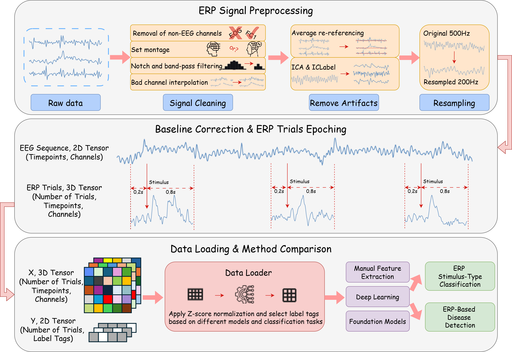
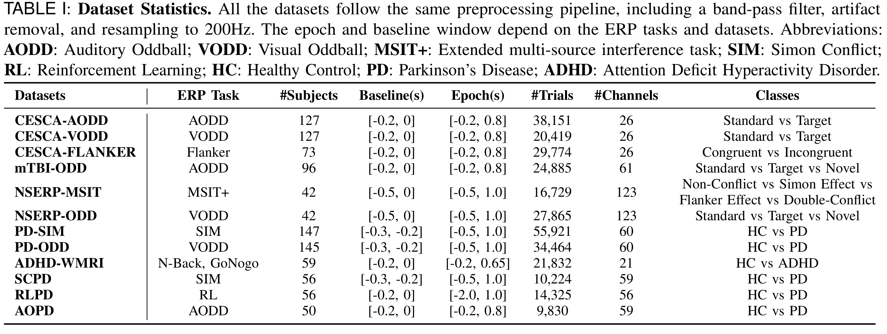

# Benchmarking ERP Analysis: Manual Features, Deep Learning, and Foundation Models

#### Authors: 
#### [Yihe Wang](https://github.com/YiheWang) (ywang145@charlotte.edu), [Zhiqiao Kang*](https://github.com/iHateGetName), [Bohan Chen*](https://github.com/BohanChen520),
####  [Yu Zhang](https://profiles.stanford.edu/176276), [Xiang Zhang](http://xiangzhang.info/) (xiang.zhang@charlotte.edu)

#### Paper Link: [Preprint](http://arxiv.org/abs/2601.00573)


## Overview of the Repository

This repository contains the description of **12 ERP datasets** and the code of the **15 methods** for the paper 
*Benchmarking ERP Analysis: Manual Features, Deep Learning, and Foundation Models*. 
In this paper, we conduct a comprehensive benchmark study that systematically compares 
traditional manual features (followed by a linear classifier), deep learning models, 
and pre-trained EEG foundation models for ERP analysis. 
We establish a unified data preprocessing and training pipeline 
and evaluate these approaches on two representative tasks, **ERP stimulus classification** 
and **ERP-based brain disease detection**, across 12 publicly available datasets. 
Furthermore, we investigate various patch-embedding strategies within advanced Transformer architectures 
to identify embedding designs that better suit ERP data. 
Our goal is to provide a landmark framework to guide method selection and tailored model design for future ERP analysis.


## Benchmark Pipeline

Input raw EEG data are preprocessed with a unified pipeline to get ERP trials, 
including removal of non-EEG channels, notch and band-pass filtering, bad channel interpolation, 
average re-referencing, artifact removal, resampling, baseline correction, 
trial epoching, and Z-score normalization. 
The processed ERP trials are loaded and passed to various models for training and classification, 
including manual feature extraction, supervised deep learning trained from scratch, 
and foundation models with pre-trained weights.


## Methods

We benchmark 15 representative methods for ERP analysis, including 2 manual feature-based methods,
10 deep learning methods trained from scratch, and 3 foundation models with pre-trained weights.
Two manual feature-based methods are implemented from scratch. Here are the raw code links for
each deep learning and foundation model method: 
[TCN](https://github.com/paul-krug/pytorch-tcn),
[ModernTCN](https://github.com/luodhhh/ModernTCN),
[TimesNet](https://github.com/thuml/TimesNet),
[PatchTST](https://github.com/yuqinie98/PatchTST),
[iTransformer](https://github.com/thuml/iTransformer),
[Medformer](https://github.com/DL4mHealth/Medformer),
[MedGNN](https://github.com/aikunyi/MedGNN),
[EEGNet](https://github.com/aliasvishnu/EEGNet),
[EEGInception](https://github.com/esantamariavazquez/EEG-Inception),
[EEGConformer](https://github.com/eeyhsong/EEG-Conformer),
[BIOT](https://github.com/ycq091044/BIOT),
[LaBraM](https://github.com/935963004/LaBraM),
[CBraMod](https://github.com/wjq-learning/CBraMod).
We modified their raw code to adapt to our ERP data and benchmark settings. 
All the methods are trained under the same data preprocessing and training pipelines for fair comparison.

The pre-trained weights for BIOT can be downloaded [here](https://github.com/ycq091044/BIOT/blob/main/pretrained-models/EEG-PREST-16-channels.ckpt)
and should be put at path `checkpoints/BIOT/pretrain_biot/BIOT/EEG-PREST-16-channels.ckpt`.
The pre-trained weights for LaBraM can be downloaded [here](https://github.com/935963004/LaBraM/blob/main/checkpoints/labram-base.pth)
and should be put at path `checkpoints/LaBraM/pretrain_labram/LaBraM/labram-base.pth`.
The pre-trained weight for CBraMod can be downloaded [here](https://huggingface.co/weighting666/CBraMod/blob/main/pretrained_weights.pth)
and should be put at path `checkpoints/CBraMod/pretrain_cbramod/CBraMod/pretrained_weights.pth`.


## Datasets

### a) Raw Data Selection
In light of the limited availability of public ERP datasets, 
we systematically searched all accessible resources known to the authors, 
including platforms such as OpenNeuro, FigShare, and PhysioNet. 
We identified **12 public datasets**, each with a sufficient sample size (40+ subjects) to ensure robust statistical evaluation
They are
[CESCA-AODD](https://openneuro.org/datasets/ds006018/versions/1.2.2),
[CESCA-VODD](https://openneuro.org/datasets/ds006018/versions/1.2.2),
[CESCA--FLANKER](https://openneuro.org/datasets/ds006018/versions/1.2.2),
[mTBI-ODD](https://openneuro.org/datasets/ds003522/versions/1.1.0),
[NSERP-MSIT](https://openneuro.org/datasets/ds004621/versions/1.0.4),
[NSERP-ODD](https://openneuro.org/datasets/ds004621/versions/1.0.4),
[PD-SIM](https://openneuro.org/datasets/ds004580/versions/1.0.0),
[PD-ODD](https://openneuro.org/datasets/ds004574/versions/1.0.0),
[ADHD-WMRI](https://figshare.com/articles/dataset/EEG_raw_data_-_Economical_Assessment_of_Working_Memory_and_Response_Inhibition_in_ADHD/12115773?utm_source=&file=22280061),
[SCPD](https://openneuro.org/datasets/ds003509/versions/1.1.0),
[RLPD](https://openneuro.org/datasets/ds003506/versions/1.1.0),
[AOPD](https://openneuro.org/datasets/ds003490/versions/1.1.0).
Note that CESCA-AODD, CESCA-VODD, and CESCA-FLANKER are three sub-datasets of the same dataset CESCA, 
and NSERP-MSIT and NSERP-ODD are two sub-datasets of the same dataset NSERP.
Preprocessing files for each dataset are provided in `data_preprocessing/` folder with readme files for instructions.


### c) Processed data

1) **Preprocessing Raw Data.**
Download the raw data from the links above in Data Selection 
and run notebooks in the folder `data_preprocessing/` for each raw dataset to get the processed dataset.
Remember to change the root path of raw data in each notebook before running if necessary.

2) **Dataset Statistics.**
The statistics of the processed datasets are shown in the figure above. 
_Baseline_ shows the time duration (in seconds) before stimulus onset used for baseline correction.
_Epoch_ shows the time duration (in seconds) before and after stimulus onset used for trial epoching.

3) **Processed Dataset Folder Paths.** 
The folder for processed datasets has two directories: `Feature/` and `Label/`. 
The folder `Feature/` contains files named in the format `feature_ID.npy` files for all the subjects, where ID is the subject ID. 
Each`feature_ID.npy` file contains ERP trials belonging to the same subject 
and stacked into a 3-D array with shape [N, T, C], N denotes the total trials for a subject,
T denotes the total timestamps for a trial, and C denotes the number of channels. 
For each dataset, the T can be calculated as: 
epoch length (in seconds) * sampling rate (in Hz), where sampling rate is all resampled to 200Hz.
The folder `Label/` contains files named in the format `label_ID.npy` files for all the subjects, where ID is the subject ID. 
Each `label_ID.npy` file is a 2-D array with shape [N, X], N denotes the total trials for a subject, same as feature file,
each column in X denotes a label type. 
The details of label type for each dataset can be found in the readme files in `data_preprocessing/` folder.
The label type used for this paper are specified in Table 1 in figure above at _classes_ column.
The processed data should be put into `dataset/200Hz/DATA_NAME/` 
so that each subject file can be located by `dataset/200Hz/DATA_NAME/Feature/feature_ID.npy`, 
and each label file can be located by `dataset/200Hz/DATA_NAME/Label/label_ID.npy`.

4) **Processed Datasets Download link.** 
For user's convenience, we also provide the processed datasets.
The processed datasets can be manually downloaded at the following link: 
https://drive.google.com/drive/folders/1pVUmPlsQN9j5HD5YJSeiDrBAUAKBCQA5?usp=drive_link


## Requirements  
  
The recommended requirements are specified as follows:  
* Python 3.10
* Jupyter Notebook
* einops==0.4.0
* matplotlib==3.7.0
* numpy==1.23.5
* pandas==1.5.3
* patool==1.12
* reformer-pytorch==1.4.4
* scikit-learn==1.2.2
* scipy==1.10.1
* sympy==1.13.1
* torch==2.5.1+cu121
* tqdm==4.64.1
* natsort~=8.4.0
* mne==1.9.0
* mne-icalabel==0.7.0
* h5py==3.13.0
* pyedflib==0.1.40
* linear_attention_transformer==0.19.1
* timm~=0.6.13
* transformers~=4.57.1

The dependencies can be installed by:  
```bash  
pip install -r requirements.txt
```


## Run Experiments
Before running, make sure you have all the processed datasets put under `dataset/`. 
You can see the scripts in `scripts/` as a reference. 
You could also run all the experiments by running meta script like `meta_run_dl_methods` file.
Make sure you have the pre-trained weights downloaded and put in proper paths before running foundation model BIOT, LaBraM, and CBraMod.
The gpu device ids can be specified by setting command line `--devices` (e,g, `--devices 0,1,2,3`). 
You also need to change the visible gpu devices in script file by setting `export CUDA_VISIBLE_DEVICES` (e,g, `export CUDA_VISIBLE_DEVICES=0,1,2,3`). 
The gpus specified by commend line should be a subset of visible gpus.


Given the parser argument `--method`,`--task_name`, `--model`, and `--model_id` in `run.py`, 
the saved model can be found in`checkpoints/method/task_name/model/model_id/`; 
and the results can be found in  `results/method/task_name/model/model_id/`. 
The default iteration number is set to 5 by command line `--itr 5`,
and run from random seed 41 to seed 45. 
There will be an average and std result at the end of the result file among 5 runs.
You can modify other parameters by changing the command line. 
The meaning and explanation of each parameter in command line can be found in `run.py` file.

Sample running script:
```bash
python -u run.py --method Medformer --task_name supervised --is_training 1 --root_path ./dataset/200Hz/ --model_id S-PD-SIM --model Medformer --data MultiDatasets --training_datasets PD-SIM --testing_datasets PD-SIM --e_layers 6 --batch_size 128 --n_heads 8 --d_model 128 --d_ff 256 --patch_len_list 25,50,100 --use_subject_vote --swa --des 'Exp' --itr 5 --learning_rate 0.0001 --train_epochs 200 --patience 15
```

## Citation

If you find this repo useful, please star our project and cite our paper.

```
@article{wang2026benchmarking,
  title={Benchmarking ERP Analysis: Manual Features, Deep Learning, and Foundation Models},
  author={Wang, Yihe and Kang, Zhiqiao and Chen, Bohan and Zhang, Yu and Zhang, Xiang},
  journal={arXiv preprint arXiv:2601.00573},
  year={2026}
}
```

## Acknowledgement

We want to thank the authors of the datasets used in this paper for generously sharing their data. 
Their efforts and contributions have been invaluable in advancing the field of EEG and ERP.
